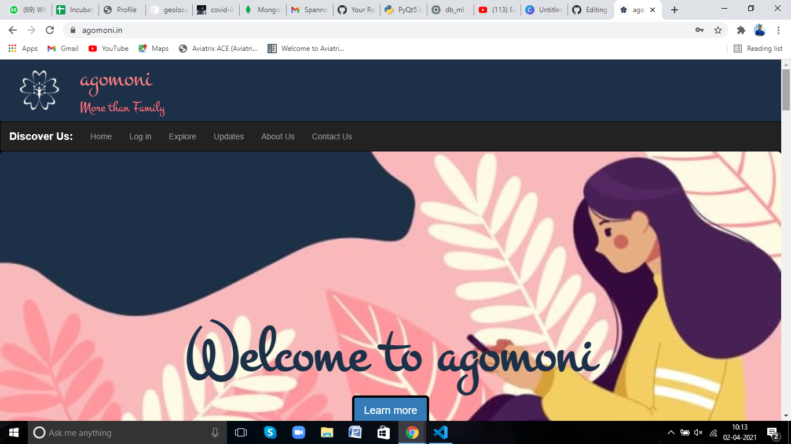
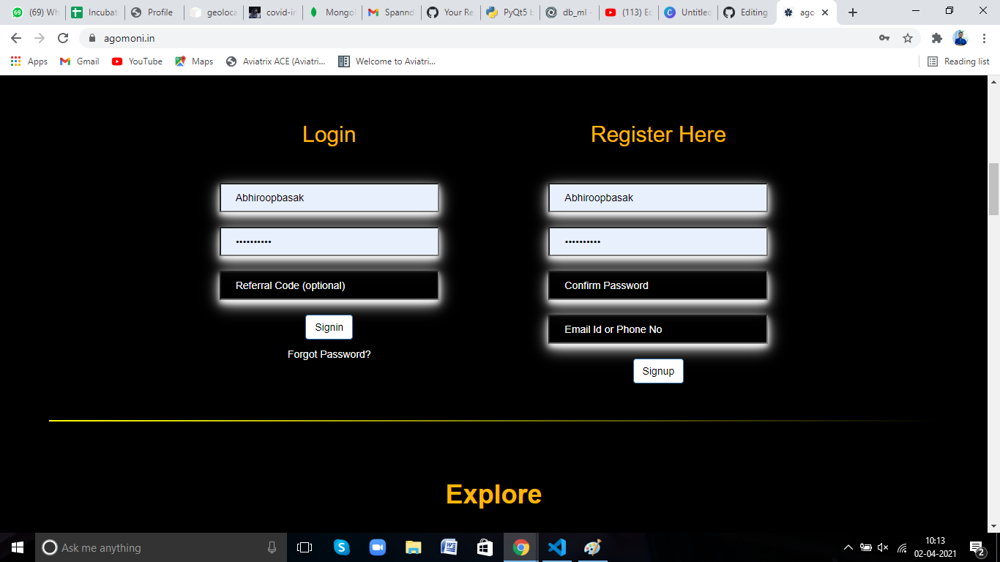
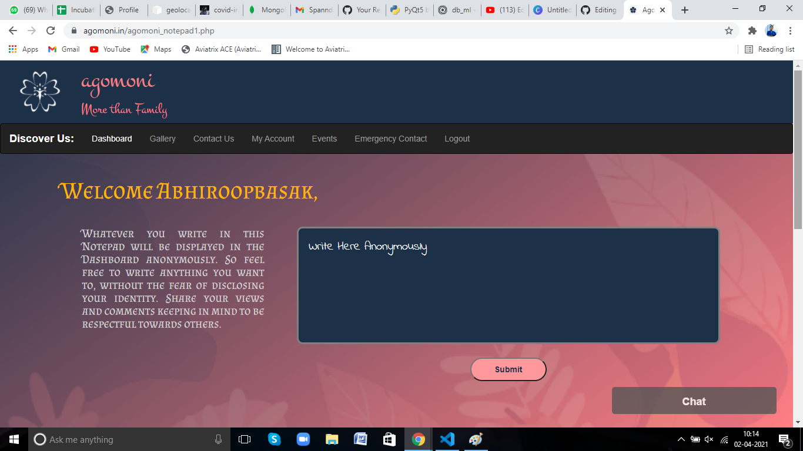

# Agomoni

Started as an initiative to ensure mental health awareness and wellbeing of teenagers specially during dificult times such as COVID

### About

Ensuring safe and secure login for users at the same time ensuring data protection and complete annonymous nature of users through out the application. Can be used to write posts as a method of venting out without having to reveal the identity. Have seen crucial utilization in voicing protests and making people's desires and complaints heard without the fear of personal grudge or loss of identity.

### Use

Visit [agomoni.in](agomoni.in)

 
 
Login and Register into the portal completely annonymous and secure. 
 
  
  
The dashboard section enables users to post annonymous content in the area and ensure security of users at the same time enabling discussions on crucial topics

  
  
 Often it is important to use professional help to ensure good mental health practises. The platform also connects users to mental health organizations on a digital level.
 
 
 
 
 Drop in suggestions at [officialagomoni@gmail.com](officialagomoni@gmail.com)

